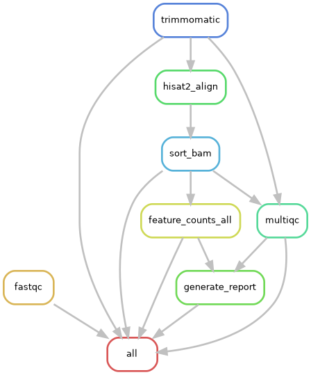

# RNAseq_Pipeline

This directory contains a Snakemake workflow for processing bulk RNA-seq data. The pipeline automates quality control, trimming, alignment, quantification, and summarization for multiple samples.

## Workflow Steps

1. **FastQC**: Quality control of raw FASTQ files.
2. **Trimmomatic**: Adapter and quality trimming of reads.
3. **HISAT2**: Alignment of trimmed reads to a reference genome.
4. **Samtools**: Sorting and indexing of BAM files.
5. **featureCounts**: Gene-level quantification, one matrix per species.
6. **Gene count matrix**: featureCounts output cleaned into a plain counts matrix,
   a CPM matrix and a gene annotation table, keyed by the metadata `sample_id`.
7. **Sample QC**: sequencing/count metrics, sample-sample correlation, hierarchical
   clustering and PCA on variance-stabilised counts.
8. **Salmon**: Transcript-level quantification, summarised to gene-level TPM with tximport.
9. **rMATS**: Alternative splicing analysis.
10. **MultiQC**: Aggregated report of QC and quantification results.
11. **NCBI submission package**: GEO and SRA metadata sheets plus md5 checksums.
12. **Project report**: `RNAseq_Project_Report.pdf`, assembled from all of the above.

DESeq2 is not part of the default target. Run it on demand, e.g.
`snakemake output/deseq2/mouse/deseq2_results.csv`.



## Directory Structure
- `Snakefile`: Main workflow definition.
- `config.yaml`: Configuration file with paths and parameters.
- `submit_snakemake.sh`: Script to submit the workflow to a cluster.
- `data/`: Raw FASTQ files and related data.
- `fastqc/`: FastQC output files.
- `logs/`: Log files for each step.
- `results/`: Processed data outputs (feature counts, alignments, quantifications).
- `multiqc_data/`: MultiQC intermediate files.
- `multiqc_report.html`: Final MultiQC report.

## Installation

```bash
git clone https://github.com/uci-grthub/uci_grthub_rnaseq_pipeline.git
cd uci_grthub_rnaseq_pipeline
```

## Usage

### 1. Prerequisites

Make sure you have Snakemake installed. You can install it using conda:

```bash
conda install -c conda-forge -c bioconda snakemake
```

Or use the pinned [pixi](https://pixi.sh) environment in `pixi.toml`, which installs
Snakemake + `snakefmt` without touching your system/conda setup:

```bash
pixi install -e snakemake-dfs
pixi run -e snakemake-dfs snakemake --cores 8
```

### 2. Configuration
 Edit `config.yaml` to set paths and parameters for your data and references.
- Sample names
- Input/output paths
- Reference file locations
- Tool parameters

### 3. Running the workflow

#### Option A: Submit to SLURM cluster
```bash
sbatch submit_snakemake.sh
```

#### Option B: Run locally (for testing)
```bash
snakemake --cores 8 --use-conda
```

#### Option C: Dry run (to check workflow)
```bash
snakemake --dry-run
```

### 4. Workflow visualization

Generate a workflow diagram:
```bash
snakemake --dag | dot -Tpng > workflow.png
```
### 5. Output

All outputs land under the directory named by `paths.output` in `config.yaml`
(`output/` by default). Per-species results use the species key from the
`species` column of the metadata CSV.

| Deliverable | Location |
| --- | --- |
| Raw read QC | `output/fastqc/` |
| Aggregated QC report | `output/multiqc_report.html` |
| Trimmed reads | `output/trimmed/` |
| Alignments and summaries | `output/hisat2_alignment/` |
| Post-alignment RNA QC | `output/rustqc/` |
| featureCounts output | `output/feature_count/<species>_samples_counts.txt` |
| Raw gene count matrix | `output/counts/<species>/gene_counts.csv` |
| CPM matrix, gene annotation | `output/counts/<species>/` |
| Transcript quantification | `output/salmon/` |
| Gene-level TPM matrix | `output/tpm/<species>/tpm_salmon.csv` |
| Correlation, clustering, PCA | `output/sample_qc/<species>/` |
| Alternative splicing | `output/rmats/<species>/` |
| GEO/SRA submission package | `output/ncbi_submission/<species>/` |
| Project report | `RNAseq_Project_Report.pdf` |

### 6. NCBI submission

`output/ncbi_submission/<species>/` holds `geo_samples.csv` (paste into the
SAMPLES section of the GEO metadata workbook), `sra_metadata.csv`, `md5sums.txt`
covering every raw and processed file, and `SUBMISSION_README.txt` listing what
to upload. Raw FASTQ checksums are reused from `data/FASTQ/md5sums.txt` when the
sequencing core supplied one, so the raw data is not re-hashed. Descriptors that
are constant across the run (tissue, instrument model) come from the `ncbi`
section of `config.yaml`.

## Requirements
- Snakemake
- Modules: fastqc, trimmomatic, hisat2, samtools, subread, salmon, singularity
- Cluster environment (recommended)

## Customization
- Adjust sample detection, references, and tool parameters in `config.yaml`.
- Modify `cluster.yaml` for resource allocation.

### For different library types:
- **Non-stranded libraries**: Change `rna_strandness` to "unstranded" and `library_type` to "IU" in `config.yaml`
- **Different strand orientation**: Modify the strandness parameters accordingly

## Key Differences from Original Script

1. **Modular design**: Each step is a separate rule
2. **Dependency management**: Snakemake automatically handles job dependencies
3. **Parallel execution**: Multiple samples can be processed simultaneously
4. **Configuration-driven**: Easy to modify parameters without editing the main workflow
5. **Resource management**: Better integration with SLURM scheduler
6. **Reproducibility**: Workflow tracks input/output dependencies

## Troubleshooting

1. Check SLURM job status: `squeue -u $USER`
2. View workflow status: `snakemake --summary`
3. Check individual rule logs in the SLURM output files

## Formatting note

`pixi run fmt` runs whatever `snakefmt` version the environment resolves to.
A newer snakefmt reflows every rule body (e.g. `exec > {log}` to `exec >{log}`),
which Snakemake reads as changed rule code and reruns the entire pipeline from
FASTQ. Check `snakemake -n` after formatting before committing.

# TODO
1. Run DESeq2 or edgeR for differential expression analysis


## Contact
For questions or issues, contact: kstachel@uci.edu
